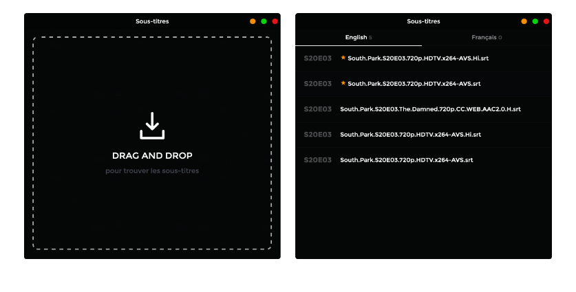

# Drag and Drop

Inspiré par [DragAndWatch](http://dragand.watch/) l'idée est d'obtenir des sous-titre rapidement par rapport à un fichier vidéo. Le but de ce projet et d'expérimenter Electron en prévision d'une future vidéo (et aussi de mettre en pratique VueJS).

[Télécharger](https://github.com/Grafikart/SubtitleMe/releases)

# Todo & Idées

Le projet est une expérimentation et je n'ai pas forcément l'intention d'y consacréer un temps considérable, il remplit mais besoin mais si vous êtes motivé voici des pistes d'évolutions :)

- Mettre une erreur si le fichier droppé n'est pas lisible (fichier sur réseau par exemple)
- Placer les boutons à gauche pour MacOS
- Trouver des APIs alternatives (surtout pour les animés / films)
- Internationaliser ?
- Créer un panneau d'option pour choisir les langues à obtenir
- Gérer le drag & drop de plusieurs fichiers (on choisirait alors les sous-titres fichier par fichier pour éviter de trop nombreux appel serveurs)
- Etendre le fonctionnement de l'application aux images (drop une image permettrait de l'optimiser avec jpegtran ou autre)
